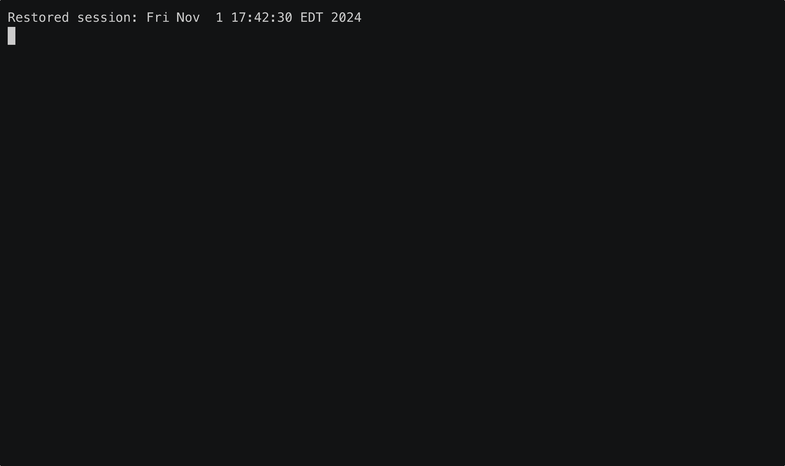

# gopinyin
Study AI-powered Chinese flashcards from the Terminal!

## What is this?
This little app uses the
- [bubbletea](https://github.com/charmbracelet/bubbletea) TUI framework for rendering a beautiful flashcard experience.
- OpenAI API for creating word usage examples automatically for each flashcard.

## Why build this?
I wanted to build a terminal UI experience with [bubbletea](https://github.com/charmbracelet/bubbletea) after seeing what the folks at [terminal.shop](https://www.terminal.shop/) did to start selling coffee via the terminal!

`gopinyin` app also helps me with my Mandarin study 😄

## 🚧 Development Notice 🚧
This app does not currently perform caching for its requests to OpenAI, so be mindful of your API usage.
